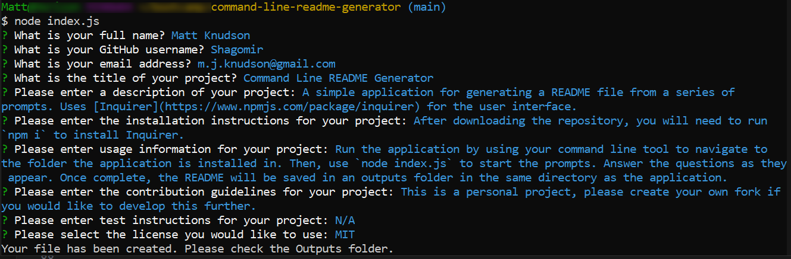

# Command Line README Generator
  
 
  ## Description
  
  A simple application for generating a README file from a series of prompts. Uses [Inquirer](https://www.npmjs.com/package/inquirer) for the user interface. 

  
  
  ## Table of Contents
  
  - [Installation](#installation)
  - [Usage](#usage)
  - [Contributing](#contributing)
  - [Tests](#tests)
  - [Questions](#questions)
  - [License](#license)
  
  ## Installation
  
  After downloading the repository, you will need to run `npm i` to install Inquirer. 
  
  ## Usage
  
  Run the application by using your command line tool to navigate to the folder the application is installed in. Then, use `node index.js` to start the prompts. Answer the questions as they appear. Once complete, the README will be saved in an outputs folder in the same directory as the application. 

  Please see the video guide provided for more information on using the application. 
  
  ## Contributing
  
  This is a personal project, please create your own fork if you would like to develop this further. 
  
  ## Tests
  
  N/A
  
  ## Questions
  
  Please reach out to me at <m.j.knudson@gmail.com> with any questions you have about this application. My GitHub profile is located at: <https://github.com/Shagomir>
  
  ## License

  [MIT License](https://opensource.org/licenses/MIT)
  
  Copyright 2023 Matt Knudson

  Permission is hereby granted, free of charge, to any person obtaining a copy of this software and associated documentation files (the “Software”), to deal in the Software without restriction, including without limitation the rights to use, copy, modify, merge, publish, distribute, sublicense, and/or sell copies of the Software, and to permit persons to whom the Software is furnished to do so, subject to the following conditions:

    The above copyright notice and this permission notice shall be included in all copies or substantial portions of the Software.
    
    THE SOFTWARE IS PROVIDED “AS IS”, WITHOUT WARRANTY OF ANY KIND, EXPRESS OR IMPLIED, INCLUDING BUT NOT LIMITED TO THE WARRANTIES OF MERCHANTABILITY, FITNESS FOR A PARTICULAR PURPOSE AND NONINFRINGEMENT. IN NO EVENT SHALL THE AUTHORS OR COPYRIGHT HOLDERS BE LIABLE FOR ANY CLAIM, DAMAGES OR OTHER LIABILITY, WHETHER IN AN ACTION OF CONTRACT, TORT OR OTHERWISE, ARISING FROM, OUT OF OR IN CONNECTION WITH THE SOFTWARE OR THE USE OR OTHER DEALINGS IN THE SOFTWARE.

